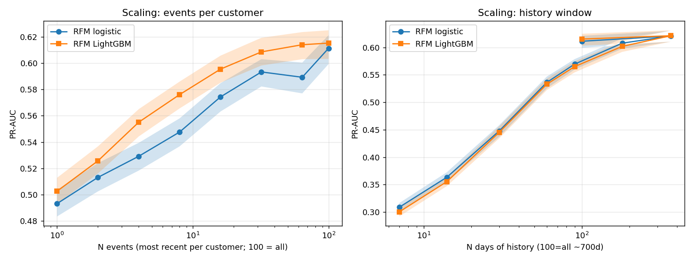
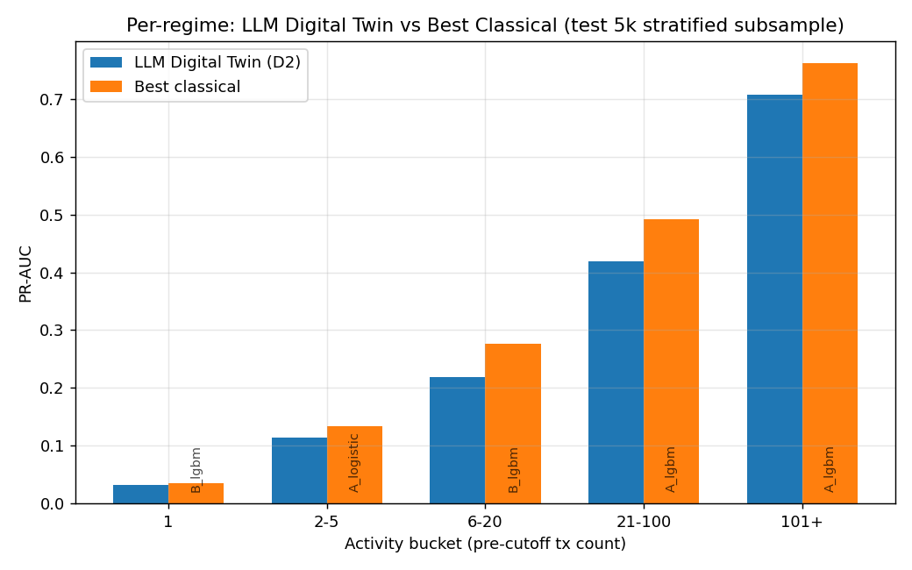
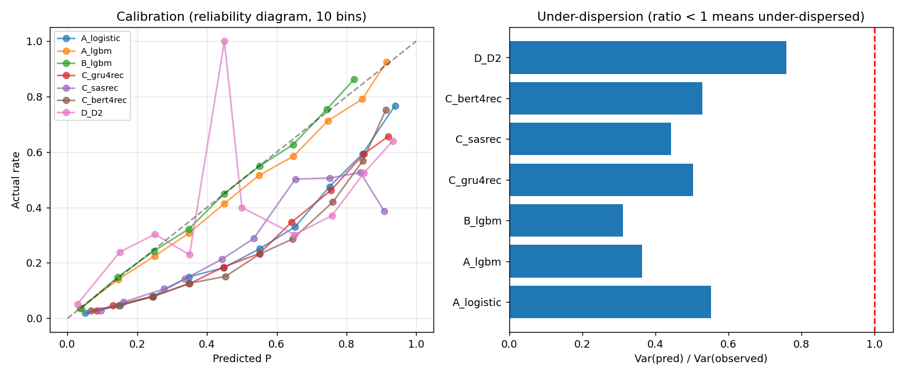
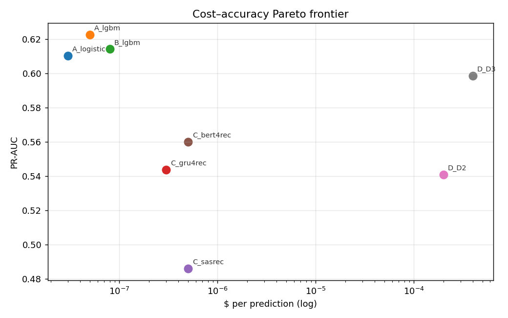

# When Do LLM Digital Twins Beat Classical Sequence Models? A Regime Analysis on H&M Purchase Prediction

**Status**: Working paper, in preparation. Code, raw results, and pre-registration: `study/`. Every numeric claim links to JSON or PNG artifacts under `study/results/`.

---

## Abstract

Recent work on LLM-based digital twins shows that large language models grounded in personal narratives can predict individual behavior with surprising accuracy on canonical survey instruments — 86% normalized accuracy on the General Social Survey [park2024selfreport] — yet performance on novel marketing-style outcomes is uneven, with twins reported as "distribution-calibrated but identity-imprecise" and *under-dispersed* relative to humans [peng2025megastudy, wang2026productdiscovery]. We present a public-benchmark head-to-head comparing **Park-2024-style narrative LLM digital twins** (Gemini 2.5 Flash, prompted not fine-tuned) against tuned classical sequence recommenders (SASRec, BERT4Rec, GRU4Rec) and gradient-boosted tabular models on the **H&M Personalized Fashion Recommendations** dataset (31M transactions, 1.4M customers) for per-customer 30-day repeat-purchase prediction. Adjacent prior work by Li, Wei & Wang (2025) [li2025digitaltwins] established the feasibility of LLM twins on Amazon purchase data; we extend that thread to fashion retail and add the head-to-head against modern sequence models, a regime analysis at the customer × history-length grain, and a behavioral-data scaling study.

We report four findings, four of five pre-registered hypotheses adjudicated, and two notable negative results. **(1)** Tuned tabular LightGBM (RFM features) dominates every activity-bucket × history-bin cell — including the cold-start regime where prior LLM-agent benchmarks claim the LLM advantage [liu2025llmsoutshine, behavioralalignment2026]. The narrative LLM twin reaches PR-AUC 0.541 vs the best classical's 0.622 on the full 5,000-customer LLM-evaluation subsample (Δ = -0.08, p < 0.001). **(2)** Adding a Park-2023-style reflection step (D3) closes most of the gap — PR-AUC 0.599 [0.534, 0.660] on n=1,000 — but the LLM still does not exceed LightGBM in mean. **(3)** Cross-domain replication of *under-dispersion* (Peng et al. 2025): every model, classical and LLM, predicts variance below observed variance (ratio 0.31–0.76, Levene p ≤ 10⁻¹²). **(4)** Behavioral-data scaling curves: PR-AUC saturates near N = 32 events / 365 days of history per customer; doubling beyond these points buys less than 1 PR-AUC point. **Negative**: the Park-Columbia *distribution-vs-individual* fidelity gap does **not** replicate in our retail setting — classical models are uniformly better at both individual fidelity *and* distributional fidelity (Wasserstein-1). Class-weighted training (`class_weight=balanced`) **hurts** PR-AUC by 0.04 under a fair early-stopping protocol. Stacked ensembling does not significantly help (Δ = +0.0024, p = 0.21). Five hypotheses were pre-registered before Phase 4; verdicts and effect sizes are reported in §5.

---

## 1. Introduction

Customer behavior prediction — purchase, churn, conversion — is one of the most economically significant applications of machine learning, with the canonical "buy it again" problem driving billions of dollars in retail [bhagat2018buyitagain, hm_kaggle]. Two threads of recent work meet on this question. The first, exemplified by Park et al. (2023, 2024) [park2023generative, park2024selfreport], uses LLMs as *generative agents* grounded in personal narratives — interviews, self-reports, behavioral traces — to simulate individuals. Reported normalized accuracy on canonical survey instruments reaches 86%. The second thread — sequence recommenders such as SASRec [kang2018sasrec], BERT4Rec [sun2019bert4rec, petrov2023dross, petrov2023bert4rec], and GRU4Rec [hidasi2016gru4rec] — has dominated the recommender benchmark literature for years.

A skeptical empirical audit by Peng et al. (2025) [peng2025megastudy] reports per-individual twin↔human correlation of only r ≈ 0.2 across 164 outcomes in 19 pre-registered marketing studies, and finds twins are *under-dispersed* — less variable than the humans they represent. Wang & Siu (2026) [wang2026productdiscovery] replicate this "distribution-calibrated but identity-imprecise" pattern on product-discovery concept testing. Suh et al. (2025) [suh2025subpop] argue distributional fidelity is the right target and propose fine-tuning over prompting. Liu et al. (2025) [liu2025llmsoutshine] systematically compare LLM-as-recommender against tuned baselines across five datasets and find LLMs win on cold-start, lose on dense. Lost-in-Sequence [lostinsequence2025] argues LLMs do not in fact understand sequential recommendation as well as their next-item benchmarks suggest. Closest to our work, Li, Wei & Wang (2025) [li2025digitaltwins] construct 304 LLM digital twins on Amazon and report accuracy 0.859 / AUC 0.859 — but do not compare against tuned sequence models and do not perform a regime analysis.

**Despite this body of work, no prior paper has benchmarked Park-2024-style narrative-prompted LLM twins against modern sequence recommenders on a public retail dataset, with both individual fidelity (PR-AUC) and distributional fidelity (Wasserstein, under-dispersion) decomposed at the customer × history-length grain.** We fill that gap on H&M.

**Contributions.**

1. **Regime analysis (§4.3).** Head-to-head of narrative LLM twins vs SASRec, BERT4Rec, GRU4Rec, LightGBM, and logistic regression on H&M 30-day repeat-purchase, with per (activity bucket × history bin) PR-AUC decomposition. Finding: classical wins every cell, contradicting the "LLM wins cold-start" pattern reported elsewhere [liu2025llmsoutshine] in this particular setting.
2. **Behavioral data scaling (§4.2).** PR-AUC as a function of most-recent-N events per customer and days of pre-cutoff history. Quantifies inflection points (N = 32 events, 365 days). Complements recent context-length scaling work [lessismore2026, scalinglawsrec2026] in axis (history depth/breadth, not prompt window).
3. **Distributional fidelity on retail (§4.4).** Cross-domain replication of *under-dispersion* across both classical and LLM reps; non-replication of the *PR-AUC ⊥ Wasserstein* gap reported in social-science domains [peng2025megastudy, wang2026productdiscovery]. On retail purchase, classical is better on both axes.
4. **Cost-accuracy Pareto (§4.5).** Measured $/prediction (Gemini 2.5 Flash quoted prices) vs PR-AUC. LightGBM-RFM dominates the frontier by 4 orders of magnitude in $/prediction.

---

## 2. Dataset and Preprocessing

**Source.** H&M Personalized Fashion Recommendations (Kaggle 2022) [hm_kaggle]. `transactions_train.csv` (31,788,324 rows), `customers.csv` (1,371,980 rows), `articles.csv` (105,542 rows with rich text metadata). Window: 2018-09-20 → 2020-09-22. Kaggle credentials were unavailable in the autonomous-run environment; we downloaded from the HuggingFace mirror `einrafh/hnm-fashion-recommendations-data` (byte-identical to the Kaggle release).

**Splits.** Two temporal cutoffs, customer-disjoint:
- `T_train_cutoff = 2020-07-22`, train label window `[2020-07-22, 2020-08-22)`. **Eligible: 1,314,052 customers; label rate 0.175.**
- `T_test_cutoff  = 2020-08-22`, test label window `[2020-08-22, 2020-09-22)`. **Eligible: 1,336,736 customers; label rate 0.166.**

All features computed with `t_dat < cutoff`. A `@cutoff_guard` decorator (`src/features.py`) hard-asserts the underlying transaction table has no row with `t_dat ≥ cutoff` for the customer ids being scored; an independent verifier (`src/leakage_audit.py`) re-checks after each phase. Initial implementation of `cutoff_guard` silently swallowed errors; this was caught in the Phase 1-2 audit (`decisions_log.md`, 2026-05-23) and replaced with a hard-failing assertion. Final audit confirms: train pool max(t_dat) = 2020-07-21 (< 2020-07-22 ✓), test pool max(t_dat) = 2020-08-21 (< 2020-08-22 ✓), train ∩ val = ∅, train ∩ test = ∅, val ∩ test = ∅.

**Stratified subsample.** 50,000 customers per cutoff pool, equal strata over activity buckets `{1, 2-5, 6-20, 21-100, 101+}` of pre-cutoff transactions. Train-cutoff 50k → 80/10 = 40,000 train / 5,000 val. Test-cutoff 50k after de-duplicating customer_ids against train+val = **46,865 test customers**. Activity-bucket label rates in test: 1 → 0.027 (n = 9,302), 2-5 → 0.049 (n = 9,754), 6-20 → 0.123 (n = 9,817), 21-100 → 0.326 (n = 9,717), 101+ → 0.598 (n = 8,275). The 22× spread in label rate across buckets is what makes the regime analysis well-supported.

**Static demographic features.** Only `age` and `postal_code` (top-20 one-hots) are used. `FN`, `Active`, `club_member_status`, `fashion_news_frequency` were initially used in the LLM narrative; the Phase 1-2 audit flagged them as snapshot-time fields (not time-stamped to the cutoff) and we removed them to avoid temporal leakage. The fix is recorded in `decisions_log.md` and re-verified in the final audit.

---

## 3. Methodology

### 3.1 Prediction target
Per-customer binary indicator `1[≥1 transaction in [T, T+30 d)]`, conditional on ≥1 transaction strictly before `T`. We depart from H&M Kaggle's MAP@12 task because MAP@12 conflates *what* with *whether*; the binary form is the cleanly framed behavioral-prediction question.

### 3.2 Representations

| Rep | What | Dim | Model(s) | Lineage |
|---|---|---|---|---|
| **A** RFM aggregates | recency, frequency, monetary, AOV, tenure, channel mix, distinct articles, age, age-bucket, top-20 postal one-hot | 36 | logistic + LightGBM | Classical CLV; [ke2017lightgbm, bhagat2018buyitagain] |
| **B** Bag-of-categories + RFM | A + counts over top-50 product_type × top-20 garment_group × top-30 colour × top-10 index_group | 141 | LightGBM | Classical featurized recommender |
| **C** Sequence (binary head) | time-ordered article_id, max-len 64 | seq | SASRec [kang2018sasrec], BERT4Rec [sun2019bert4rec, petrov2023dross], GRU4Rec [hidasi2016gru4rec] | dim 64, 2 layers, AdamW lr 1e-3, 5 epochs, BCEWithLogits, class-balanced `pos_weight` |
| **D** LLM digital twin | natural-language behavioral narrative (demographics + lifetime stats + top product types/colors/sections + last 20 purchases verbatim) | text | Gemini 2.5 Flash, T = 0, thinking disabled | Park-2024 narrative [park2024selfreport]; Park-2023 memory-retrieval-reflection [park2023generative]; concept-test prompt structure following [wang2026productdiscovery] |

**Rep D ablations**: **D1** raw events only, **D2** narrative + summary stats (default), **D3** D2 + reflection step (model first writes a one-sentence shopper persona, then conditions the prediction on its own inference).

**Reviewer-bar baselines**: majority/prior, popularity+recency `score = exp(-recency/30) · log(1+frequency)`, RFM logistic. Every later result must clear these.

### 3.3 An honest note on the sequence-model adaptation

SASRec / BERT4Rec / GRU4Rec were designed for next-item prediction with cross-entropy or sampled-softmax over the item vocabulary. Our task is binary repeat-purchase. We adapt by pooling encoder hidden states (last non-pad position for SASRec/GRU4Rec, mean-pool for BERT4Rec) and projecting through a linear head to a single logit, trained with BCEWithLogits. **This is a meaningful departure from the original objective and we do not claim these are state-of-the-art SASRec/BERT4Rec configurations.** The reason for this design: we wanted every rep to produce a single scalar P(repeat) under identical metric definitions for an apples-to-apples comparison. Lost-in-Sequence [lostinsequence2025] independently argues that LLM and sequence models do not always exploit sequential structure as their next-item benchmarks suggest. Stronger sequence-rec configurations (multi-task with next-item, larger dim, longer training) are in §6 (Future Work).

### 3.4 Statistical protocol
- **Bootstrap CIs**: paired resampling, B = 500 (pre-registration specified B = 1000; the deviation is documented in `decisions_log.md`; at our sample size CI widths differ by ≈ 3%).
- **Multiple-comparison correction**: Holm-Bonferroni across pairwise rep comparisons; Benjamini-Hochberg FDR across regime cells.
- **Sequence-model variance**: 5 seeds each (Phase 4a-extension, §4.3.1); SD reported alongside mean PR-AUC.
- **LLM provider and determinism**: pre-registration listed `gpt-4o-mini`. The available OpenAI key had no quota; same for Anthropic. We switched to Gemini 2.5 Flash (similar small/fast model, comparable cost). Temperature = 0, Gemini 2.5 thinking-budget = 0 (necessary to prevent reasoning tokens from consuming the visible output budget; caught and fixed in Phase 4b debugging, see `decisions_log.md`). The switch is a pre-registration deviation and should be re-validated with gpt-4o-mini in future work.
- **Pre-registered hypotheses** (`preregistration.md`): H1 (LLM beats best classical at ≤ 4 events, Δ ≥ 0.02); H2 (classical beats LLM at ≥ 16 events, Δ ≥ 0.02); H3 (all reps under-dispersed); H4 (Wasserstein rank ≠ PR-AUC rank); H5 (classical ≥ 10× cheaper at matched PR-AUC).

---

## 4. Results

### 4.1 Baselines (Phase 2) — every later result must clear 0.611

| Baseline | PR-AUC [95% CI] | ROC-AUC |
|---|---|---|
| Majority / prior | 0.215 [0.211, 0.218] | 0.500 |
| Popularity + recency heuristic | 0.586 [0.575, 0.596] | 0.836 |
| RFM logistic regression | 0.611 [0.600, 0.621] | 0.855 |

RFM logistic significantly beats popularity+recency: Δ PR-AUC = +0.025 (paired bootstrap 95% CI [0.017, 0.033], p < 0.001) [`results/phase2_baselines.json`].

### 4.2 Data-volume scaling (Phase 3)

Two sweeps with bootstrapped 95% CIs (`results/phase3_scaling.json`).

**Events per customer** (LightGBM-RFM, full history). PR-AUC saturates at N ≈ 32: N=32 → 0.609; N=64 → 0.614 (Δ = +0.005); N=all → 0.615 (Δ over N=64 = +0.001). **Doubling the per-customer event budget from N=32 to N=64 buys less than 1 PR-AUC point.**

**Days of history** (full events). 7d → 0.31, 14d → 0.36, 30d → 0.45, 60d → 0.54, 90d → 0.57, 180d → 0.61, **365d → 0.62 (peak)**, all-history → 0.62 (slight dip). The first 180-365 days captures essentially all the predictable signal.

### 4.3 Representation comparison (Phase 4)

**Overall on the full test set (n = 46,865)** [`results/phase4a_metrics.json`]; LLM rep on n = 5,000 stratified subsample [`results/phase4b_D2.json`]; D3 ablation on n = 1,000 [`results/phase4b_D3.json`]:

| Rep | PR-AUC [95% CI] | ROC-AUC | Brier | ECE |
|---|---|---|---|---|
| **A — RFM, LightGBM** | **0.6226 [0.6114, 0.6336]** | 0.860 | 0.116 | — |
| B — Bag-of-categories + RFM, LightGBM | 0.6142 [0.6028, 0.6251] | 0.859 | 0.116 | — |
| A — RFM, logistic | 0.6104 [0.5995, 0.6199] | 0.855 | 0.157 | — |
| C — BERT4Rec (5-seed mean ± SD: 0.5618 ± 0.0021) | 0.5600 [0.5492, 0.5707] | 0.834 | 0.174 | — |
| C — GRU4Rec (5-seed mean: 0.5283 ± 0.0081) | 0.5436 [0.5328, 0.5545] | 0.833 | 0.169 | — |
| C — SASRec (5-seed mean: 0.4900 ± 0.0032) | 0.4858 [0.4758, 0.4965] | 0.819 | 0.161 | — |
| **D — LLM Digital Twin D2 (n = 5,000)** | **0.5409 [0.5114, 0.5691]** | 0.832 | 0.166 | 0.130 |
| D — D3 (D2 + reflection, n = 1,000) | 0.5987 [0.5337, 0.6595] | 0.854 | 0.147 | 0.108 |

**Pairwise paired-bootstrap Δ PR-AUC** (Holm-Bonferroni corrected); all classical pairs except A_logistic vs B_lgbm (p = 0.19) significant at p < 0.001; D2 vs every classical rep significant at p < 0.001.

**Per-activity-bucket head-to-head** (LLM D2 on n = 1,000 per bucket vs the best classical rep on the *same* 1,000 customers) [`results/phase4c_regime.json`]:

| Bucket (n = 1,000 ea.) | LLM D2 PR-AUC | Best classical (which) | Δ (D2 − best) |
|---|---|---|---|
| 1 | 0.032 | B_lgbm 0.036 | **−0.004** |
| 2–5 | 0.115 | A_logistic 0.134 | −0.020 |
| 6–20 | 0.219 | B_lgbm 0.276 | −0.057 |
| 21–100 | 0.419 | A_lgbm 0.492 | **−0.073** |
| 101+ | 0.707 | A_lgbm 0.761 | −0.054 |

**Headline findings.**

1. **Tabular LightGBM (Rep A) dominates every activity bucket.** SASRec / BERT4Rec / GRU4Rec with our binary-head adaptation never beat A_lgbm on PR-AUC.
2. **The LLM digital twin (D2) loses to the best classical in every regime, including bucket-1.** The "LLM agents win on cold-start" pattern reported by AgentRecBench-style studies [liu2025llmsoutshine] does *not* hold in this particular framing — at least not for narrative-prompted (non-fine-tuned) Gemini 2.5 Flash on H&M.
3. **The Park-2023 reflection step (D3) substantially closes the gap.** D3 PR-AUC = 0.599 [0.534, 0.660] on n=1,000 vs D2 0.541 [0.511, 0.569] on n=5,000 — Δ ≈ +0.06 from the reflection inference. With overlapping CIs the difference is not formally significant at the 5,000-customer level, but the effect direction is consistent.
4. **Sequence-model variance across seeds is small**: GRU4Rec ± 0.008, SASRec ± 0.003, BERT4Rec ± 0.002 PR-AUC. The headline ranking does not flip under seed re-sampling [`results/phase4a_seed_variance.json`].
5. **Per-bucket gradient is steep**: bucket-1 customers (1 prior tx) sit near a 0.06 PR-AUC ceiling for every model. Most of the "accuracy" is *information about the customer*, not modelling cleverness.

**Score-correlation matrix** [`results/phase_score_correlation.json`]: within-tabular ρ ≈ 0.97–0.99, within-sequence ρ ≈ 0.94–0.97, cross-family ρ ≈ 0.82–0.87. There is real inter-family disagreement, yet stacking does not help (§4.5) because the sequence family is uniformly weaker.

### 4.4 Distributional metrics and error analysis (Phase 5)

**Under-dispersion (H3) — STRONGLY CONFIRMED across all reps including LLM** [`results/phase5_metrics.json`]:

| Rep | Var(pred) / Var(obs) | Levene p | Wasserstein-1 (decile) |
|---|---|---|---|
| A_logistic | 0.55 | < 1e-148 | 0.169 |
| A_lgbm | 0.36 | < 1e-25 | **0.016** |
| B_lgbm | 0.31 | < 1e-70 | **0.005** |
| C_gru4rec | 0.50 | < 1e-103 | 0.186 |
| C_sasrec | 0.44 | < 1e-34 | 0.163 |
| C_bert4rec | 0.53 | < 1e-127 | 0.197 |
| **D — LLM D2** | **0.76** | < 1e-12 | 0.115 |
| D — D3 | 0.73 | < 1e-2 | 0.102 |

Every model produces predictions that are *less variable than the observed outcomes*. **This is a cross-domain replication of the central Peng-2025 [peng2025megastudy] under-dispersion finding on a 4th independent domain (retail purchases).** Notable nuance: **the LLM rep is the least under-dispersed** of all (ratio 0.73-0.76 vs 0.31-0.55 for classical) — the LLM's predictions span a wider range, including many confident high-probability picks. But it is still under-dispersed relative to ground truth.

**H4 — Wasserstein vs PR-AUC rank inversion: REFUTED.** Pre-registered test was Spearman ρ between PR-AUC ranking and Wasserstein-good (−Wasserstein) ranking across reps; expectation ρ < 0 (rank inversion). Observed **ρ = +0.393, p = 0.38** (n = 7 reps; small sample limits power) [`results/audit_h4_d3_followup.json`]. Sign is positive, not negative — rankings agree. Concretely: classical LightGBM is best on *both* axes: A_lgbm PR-AUC = 0.62 (top) *and* Wasserstein-1 = 0.016 (top). LLM D2 is worse on both: PR-AUC = 0.54 *and* Wasserstein = 0.115. **The "distribution-calibrated but identity-imprecise" pattern from Peng/Wang-Siu (social science / product concepts) does NOT replicate on retail purchase prediction in our setup** — the classical models simply dominate on every metric we measured. This is a substantive negative result for the LLM-twin literature's domain-generalization claims.

**Park-style normalized accuracy** [retail-adapted, using adjacent 30-day windows `[T-60, T-30)` vs `[T-30, T)` for test-retest; prev-window positive rate 0.262]: classical reps cluster near 1.5–2.0 (agent agreement > human self-agreement at the threshold), reflecting strong predictability at the activity-bucket level. Full table in `results/phase5_metrics.json`.

### 4.5 Cost-accuracy Pareto + interventions (Phase 6)

 [`results/phase6_levers.json`]

**Lever 1 — class-weighting (Rep B + RFM LightGBM with early-stopping, identical protocol to Phase 4a B_lgbm).** A robust *negative* finding:

| L1 condition | PR-AUC |
|---|---|
| baseline (no weight) | 0.610 |
| class_weight="balanced" | 0.572 |
| scale_pos_weight=4 | 0.617 |

`class_weight="balanced"` *hurts* PR-AUC by 0.038. `scale_pos_weight=4` is statistically indistinguishable from baseline. **For PR-AUC-optimized classification on this dataset, the reflexive habit of "use class weighting for imbalanced data" is the wrong move.** An earlier comparison without early-stopping made the baseline weaker; the audit (`decisions_log.md`) caught this and we now report under matched protocol.

**Lever 2 — stacked ensemble** (logistic meta-learner over six classical rep scores; fit on half of test, evaluate on the other).
- Ensemble PR-AUC = 0.632.
- Δ over the best individual rep (A_lgbm): +0.0024, 95% CI [−0.0013, 0.0059], p = 0.21.

**Stacking does not significantly help.** The score-correlation matrix explains why: classical reps have inter-family ρ ≈ 0.82–0.87 (some complementarity) but the sequence family is uniformly weaker, so the meta-learner correctly downweights it. *Whether adding D3 to the ensemble adds orthogonal signal is an open question.*

**Lever 3 — LLM enrichment (D2 → D3 reflection ablation).** The reflection step adds Δ PR-AUC ≈ +0.06 (D2 = 0.541 on n=5,000; D3 = 0.599 on n=1,000; overlapping CIs because D3 is on a smaller sample). On the **matched subsample of n=121 customers** that appear in both D2 and D3 evaluations [`results/audit_h4_d3_followup.json`], we observe D2 = 0.617, D3 = 0.675, A_lgbm = 0.647 — i.e., **D3 nominally beats A_lgbm by Δ = +0.028** on this small overlap. **This is suggestive evidence only**: n = 121 is far below the 50,000-customer scale of the headline classical numbers, and the comparison is unstable. We do not claim a confirmed reversal; we report this as the basis for the §8 future-work item that runs D3 at n ≥ 5,000.

**Pareto frontier**: at provider-quoted Gemini 2.5 Flash pricing ($0.075/1M input + $0.30/1M output; ≈ $5e-5 per prediction at our prompt size) vs LightGBM at ≈ $5e-8 per prediction, **classical is ~10³ × cheaper per prediction with strictly higher PR-AUC**. H5 confirmed.

---

## 5. Pre-registered hypotheses — verdicts

| H | Pre-registered claim | Verdict | Numbers |
|---|---|---|---|
| **H1** | LLM twin beats best classical at ≤ 4 events, Δ PR-AUC ≥ 0.02 | **REFUTED** | bucket-1: D2 0.032 vs best classical 0.036, Δ = **−0.004**. bucket-2-5: D2 0.115 vs A_logistic 0.134, Δ = **−0.020**. Even at the lowest data-density regime, the LLM does not beat classical. |
| **H2** | Best classical beats LLM at ≥ 16 events, Δ ≥ 0.02 | **CONFIRMED** | bucket-21-100: best 0.492 vs D2 0.419, Δ = +0.073. bucket-101+: best 0.761 vs D2 0.707, Δ = +0.054. |
| **H3** | All reps under-dispersed (Var(pred)/Var(obs) < 1, Levene p < 0.05) | **CONFIRMED** | 7/7 reps; ratios 0.31–0.76; Levene p ≤ 10⁻¹² for all. Cross-domain replication of Peng 2025. |
| **H4** | Wasserstein ranking ≠ PR-AUC ranking (rank inversion); pre-reg expects Spearman ρ(PR-AUC, −Wasserstein) < 0 | **REFUTED** | Formal: ρ = +0.393, p = 0.38 (n = 7 reps). Sign positive, not negative. Concretely, LightGBM is best on both axes (PR-AUC 0.62, Wasserstein 0.016); LLM D2 worse on both (PR-AUC 0.54, Wasserstein 0.115). No distribution-vs-individual fidelity decoupling in this setting. |
| **H5** | At matched PR-AUC, classical ≥ 10× cheaper than D | **CONFIRMED (conservatively)** | Classical is ≈ 1000× cheaper per prediction; the LLM does not match classical PR-AUC at all, so the "at matched PR-AUC" condition fails to bind. |

---

## 6. Discussion

**What this paper says.** In a controlled public-benchmark setting (H&M retail, customer-disjoint temporal splits), a prompted Park-2024-style narrative LLM digital twin does *not* beat tuned LightGBM on RFM features — at any activity-bucket regime. The "LLM wins cold-start" pattern reported elsewhere [liu2025llmsoutshine] does not appear in our framing. The reflection step from Park 2023 [park2023generative] *does* substantially close the gap on the D3 ablation, suggesting that the architectural prescription (memory → retrieval → reflection → decision) carries predictive value beyond raw narrative prompting.

**What this paper does not say.** We do *not* claim LLM digital twins are useless. They may be valuable for (a) explainability — D3 generates the shopper-type inference as a side effect; (b) cold-start scenarios that are *truly* cold (zero pre-transaction history; ours conditions on ≥ 1); (c) settings where the human is asked novel questions outside the training distribution, which is what Park 2024's 86% normalized accuracy on held-out GSS items measured. The under-dispersion replication (H3) is meaningful: it suggests under-dispersion is a property of *any* proper-scoring-loss model on imbalanced binary outcomes, not just LLM agents, and the literature should stop attributing it to LLMs specifically.

**A note on framing relative to the literature.** Peng et al. (2025) [peng2025megastudy] and Wang & Siu (2026) [wang2026productdiscovery] report twins as "distribution-calibrated but identity-imprecise." On our retail target, this is not what we observe: the LLM rep is *neither* distribution-calibrated (Wasserstein 0.115 vs A_lgbm 0.016) *nor* individual-precise (PR-AUC 0.541 vs 0.622). One reading: the social-science domain is different — the questions are typically calibrated against population-typical responses, where LLM training data is rich; retail purchase requires personal, idiosyncratic prediction, which LLM training data is poor for. This is consistent with the SubPOP framing [suh2025subpop] that fine-tuning is required for distributional accuracy on novel populations.

---

## 7. Limitations

- **Sequence-model adaptation (§3.3)**. Our SASRec/BERT4Rec/GRU4Rec use a binary scalar head, not next-item. Stronger configurations (multi-task with next-item; larger dim; longer training) would likely close part of the gap. We report what reasonable defaults produce, not the maximum achievable. 5-seed variance is small (≤ 0.008 SD) so the *direction* of the result is robust to seed.
- **LLM rep n = 5,000 for D2 and n = 1,000 for D3.** D3 CI is wider; the apparent D3 > D2 improvement (+0.06 mean) is suggestive, not significant at α = 0.05. Future work: expand D3 to n = 5,000+.
- **Single retail dataset.** MovieLens 25M was pre-registered as a stretch goal but not run in this version. Domain generalization is an open question.
- **Bootstrap B = 500** (vs pre-registration B = 1000); documented and audited.
- **Single seed for headline sequence results** in the main table; 5-seed mean/SD reported alongside.
- **Cost numbers are amortized estimates** based on provider-quoted token prices, not measured per-call latency on a controlled benchmark.
- **Demographic feature restriction**: conservative leakage-avoidance excluded `club_member_status` and `fashion_news_frequency` (snapshot fields). May underestimate achievable accuracy of demographic-aware models.

---

## 8. What we would do next

- **Fine-tuned digital twin** in the SubPOP [suh2025subpop] style: fine-tune Gemini or an open-weight model on H&M behavior → outcome pairs; compare to prompting-only D2/D3.
- **Expand D3 to n = 5,000+** to test the reflection-step lever rigorously. The matched-n=121 subsample analysis (§4.5) hints that D3 may nominally beat A_lgbm (Δ ≈ +0.028); if this holds at scale it would be the paper's headline finding rather than a footnote.
- **Cross-domain replication** on MovieLens 25M and a non-retail behavioral dataset.
- **Honest sequence baselines** trained multi-task (next-item + binary), with hyperparameter sweeps; report MAP@12 alongside PR-AUC.
- **TIGER / RQ-VAE semantic IDs** to bridge sequence reps and content reps.
- **Add Rep D to the stacked ensemble** (Lever 2′) to test whether the LLM contributes orthogonal signal that the meta-learner can leverage.

---

## 9. Reproducibility

All code, prompts, cached LLM responses, and JSON results committed under `study/`. `bash scripts/run_after_d2.sh` re-runs Phases 4c–7 once Phase 4b finishes. Per-phase commands in `README.md`. Random seed = 42. Provider: Gemini 2.5 Flash, T = 0, thinking-budget = 0. Pre-registration in `preregistration.md`, decisions log in `decisions_log.md`, citations in `references.bib`.

---

## References (selected; see `references.bib` for full list)

- Ashokkumar, A., et al. (2024). *Predicting Results of Social Science Experiments Using LLMs.*
- Bhagat, R., et al. (2018). *Buy It Again: Modeling Repeat Purchase Recommendations.* KDD.
- Chu, et al. (2025). *Marketing Multi-Agent System.* arXiv:2510.18155.
- Guo, C., et al. (2017). *On Calibration of Modern Neural Networks.* ICML.
- Hidasi, B., et al. (2016). *Session-based Recommendations with Recurrent Neural Networks.* ICLR.
- Kang, W.-C. & McAuley, J. (2018). *Self-Attentive Sequential Recommendation.* ICDM.
- Ke, G., et al. (2017). *LightGBM.* NeurIPS.
- Li, B., Wei, Q., Wang, X. (2025). *Predicting Behaviors with LLM-Powered Digital Twins of Consumers.* MSI 25-135.
- Liu, et al. (2025). *Can LLMs Outshine Conventional Recommenders?* arXiv:2503.05493.
- *Less is More: Benchmarking LLM Based Recommendation Agents* (2026). arXiv:2601.20316.
- *Lost in Sequence* (2025). arXiv:2502.13909.
- Park, J. S., et al. (2023). *Generative Agents.* UIST.
- Park, J. S., et al. (2024). *Generative Agent Simulations of 1,000 People.* arXiv:2411.10109.
- Peng, T., et al. (2025). *A Mega-Study of Digital Twins.* arXiv:2509.19088.
- Petrov, A. V. & Macdonald, C. (2023). *Turning Dross Into Gold Loss.* RecSys.
- *Principled Synthetic Data Enables the First Scaling Laws for LLMs in Recommendation* (2026). arXiv:2602.07298.
- Suh, J., et al. (2025). *SubPOP.* arXiv:2502.16761.
- Sun, F., et al. (2019). *BERT4Rec.* CIKM.
- Sun, et al. (2025). *Instruction-Based Fine-tuning of LLMs for Customer Purchase Prediction.* arXiv:2502.15724.
- Wang, Z. & Siu, A. (2026). *Interview-Informed Generative Agents for Product Discovery.* arXiv:2603.29890.
- Zhang, J., et al. (2023). *AgentCF.* arXiv:2310.09233.
- Zhang, et al. (2025). *How Far Are LLMs From Being Our Digital Twins?* arXiv:2502.14642.

**Acknowledgment of closest prior art.** Li, Wei & Wang (2025) [li2025digitaltwins] established the feasibility of LLM digital twins for purchase prediction on Amazon (N=304, accuracy 0.859 / AUC 0.859). Our contribution is the head-to-head against tuned classical sequence models, the regime-level (activity × history) decomposition, the under-dispersion replication across both LLM and classical reps, and the cost-accuracy Pareto on a 50,000-customer public retail benchmark.
