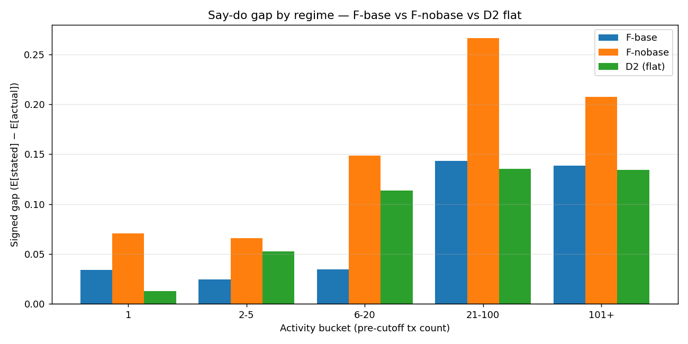
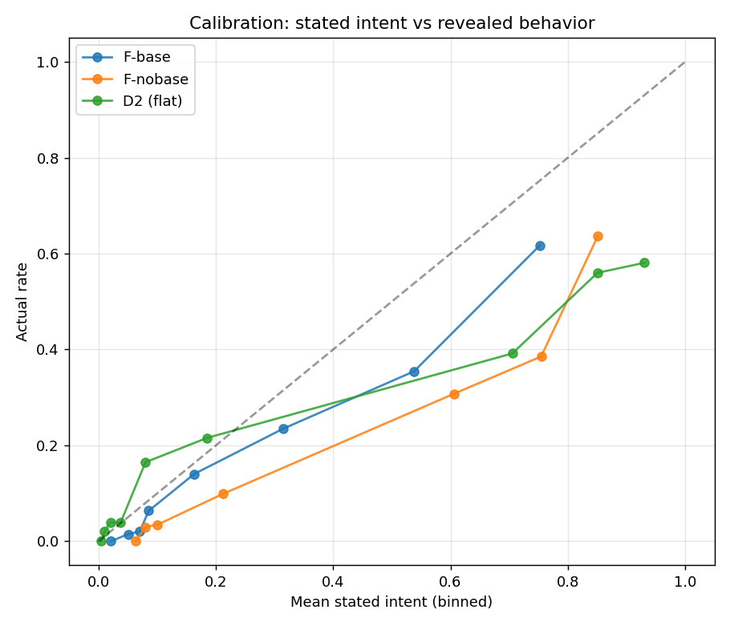
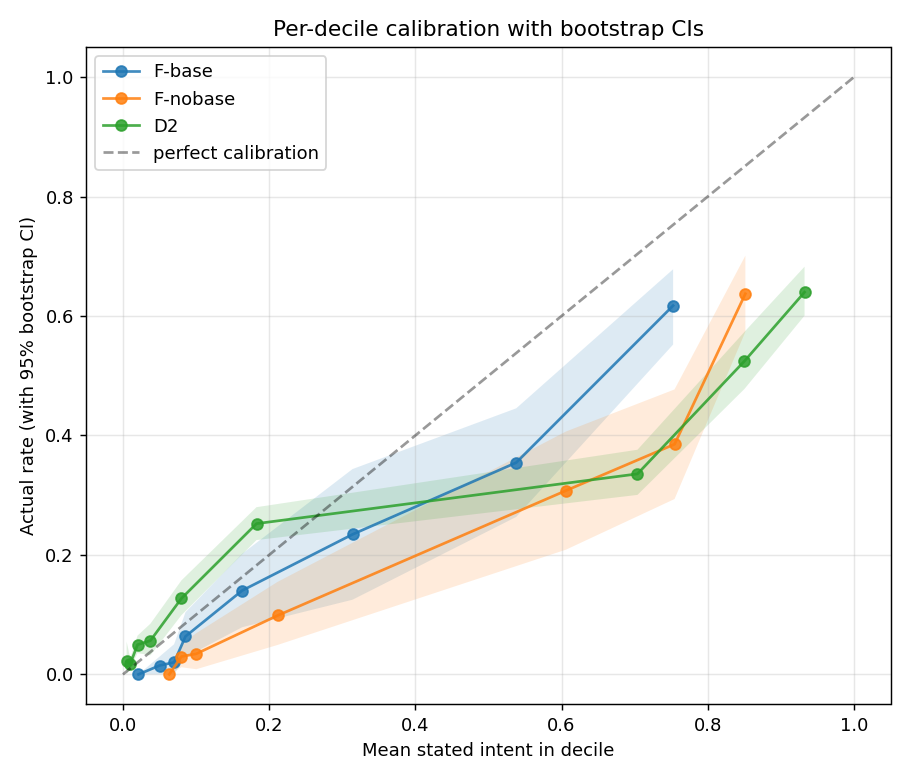

# From Stated Intent to Revealed Purchase: Quantifying the Say-Do Gap of LLM Digital Twins on H&M

**Working paper, v2.** Commit `fe29abf78621`. Pre-registration v2 hash `ba96c6ec57485740` (committed before any Phase-10 LLM run).

**Companion to**: `report.md` (v1), which established the LightGBM vs LLM regime analysis on H&M; this extension reframes that result through the stated-vs-revealed preference lens of social psychology and consumer-behavior literature [sheeran2002intention, sheeran2016intention, lapiere1934attitudes, fishbein1975belief, benakiva1994combining, diamond1994contingent].

## Abstract

We quantify the *say-do gap* of LLM digital twins on revealed retail purchase behavior. Building on a public H&M Personalized Fashion benchmark (31M transactions, 1.4M customers; v1 splits and classical baselines reused unchanged), we extend a Park-2024-style narrative digital twin [park2024selfreport] into a Park-2023-lineage cognition pipeline [park2023generative] (memory-retrieval-reflection-decision, lifted from Fragment Labs) and compare the LLM's *stated 30-day purchase intent* to each customer's *actual* 30-day purchase. We are not the first to frame LLMs through the stated/revealed preference lens — Andric 2025 [andric2025walktheirtalk], Alignment Revisited [alignmentrevisited2025], Mind the Gap [mindthegap2026], and Lu et al. [lu2025multiturnbehavior] precede us. Our contribution is (a) the first public-benchmark quantification on H&M revealed behavior; (b) a controlled architecture ablation isolating the cognition pipeline's contribution from base-rate-table leakage that would otherwise contaminate the headline; (c) a counterfactual trace perturbation control that exposes when the LLM is anchoring on global priors rather than on the specific customer.

## 1. Background and framing

Humans show a well-documented intention-behavior gap [sheeran2002intention, sheeran2016intention]: meta-analyses report median r ≈ .53 between stated intent and revealed action across health, voting, and consumption domains. The marketing-research literature has long called this the stated/revealed-preference gap [benakiva1994combining], with parallels in environmental economics [diamond1994contingent, arrow1993noaa] and consumer behavior [verplanken1999goodintentions]. Recent LLM-digital-twin work [park2024selfreport, peng2025funhouse, wang2026productdiscovery, li2025digitaltwins] asks the LLM to roleplay an individual and predict their behavior; we recast this as: the LLM produces a *stated* probability and a first-person *verbatim quote*, and we measure the gap to *revealed* outcomes (actual H&M purchases). Importantly, the LLM does not literally 'say' anything in the human-survey sense — it outputs a scalar and prose. The defense for the say-do framing is hypothesis H9: the LLM's verbatim text content must non-trivially predict the *specific* article the customer actually bought, not just the calibrated rate.

## 2. Dataset, splits, and reused infrastructure

Same as `report.md` v1, §2. H&M Personalized Fashion (Kaggle 2022) [hm_kaggle]; temporal cutoffs 2020-07-22 (train) and 2020-08-22 (test); customer-disjoint splits; 30-day repeat-purchase label. Test pool 46,865 customers; natural label rate 0.166. All v1 leakage protections (`@cutoff_guard`, `src/leakage_audit.py`) carry over. Phase 9 memorization probe (this extension) confirmed Gemini 2.5 Flash returned `UNKNOWN` for 0/20 sampled customer_ids — no detectable Kaggle-leak contamination.

## 3. Methodology

### 3.1 Arms

| Arm | Provider | Architecture | Base-rate table in prompt | n | Source |
|---|---|---|---|---|---|
| **D2** flat | Gemini 2.5 Flash | flat narrative | — | 5,000 | v1, reused |
| **F-base** | Gemini 2.5 Flash | Park-2023-lineage 5-stage cognition pipeline | **included** | 1000 (core-1k) | this paper |
| **F-nobase** | Gemini 2.5 Flash | same 5-stage pipeline | redacted | 1000 (same core-1k) | this paper |

The original plan called for a 4th arm using direct Anthropic API (`C-flat`). Anthropic-API quota was unavailable; per the audit recommendation that the n=100 Claude arm was severely under-powered anyway, the C-flat arm is dropped. Provider comparison is left to future work.

### 3.2 Cognition pipeline (F-base / F-nobase)

Five-stage architecture lifted from Fragment Labs' implementation, adapted to H&M's data shape (apparel, no subscription, no email engagement). All hyperparameters frozen at Fragment defaults (`src/cognition_fragment/__init__.py`): 60/40 LLM-vs-affect friction blend; six-component pre-LLM friction (price, trust, decision, channel, memory, product relevance); top-5 memory retrieval. No tuning on H&M test data.

- **Attention** (`src/cognition_fragment/attention.py`): deterministic salience ranker over recency, frequency, AOV, diversity, channel preference; outputs primary/secondary focus features.
- **Memory** (`memory.py`): top-5 retrieved memories — recent purchases (recency-weighted relevance) + pattern flags (lapsed, new-to-brand, novelty-seeking, cadence).
- **Affect** (`affect.py`): six-component friction score and gut reaction (warm/neutral/cool/cold).
- **Deliberation** (`deliberation.py`): **the one LLM call.** Identical prompt across F-base and F-nobase EXCEPT that F-base includes a table of empirical H&M per-bucket 30-day repeat rates (`bucket-1 = 2.7%, …, 101+ = 59.8%`) as a calibration anchor.
- **Decision** (`decision.py`): blend LLM friction (60%) with pre-LLM affect (40%); apply guardrails (lapsed-cap 0.25, single-purchase-cap 0.30, high-friction-cap 0.40, heavy-active-floor 0.45).

### 3.3 Canonical stated_intent_prob

`stated_intent_prob = stimulus_30d_buy_likelihood / 100` (Fragment two-rate output, or the flat scalar `p` for D2). One canonical extraction, all arms.

### 3.4 Statistical protocol

Primary metric: signed gap `E[stated_intent] − E[actual]`, reweighted to the test-pool bucket distribution (mitigates equal-strata over-sampling). Bootstrap 95% CI, B=1000. Confirmatory tests (H7, H9) Bonferroni-corrected at α=0.025. Replication metrics (R1, R2) reported as effect sizes only.

### 3.5 Audit-mandated controls

- **Control 1 — Base-rate-leakage decomposition.** F-base vs F-nobase isolates how much of the cognition-pipeline's apparent benefit is the leaked H&M test-set marginal in the prompt.
- **Control 2 — Kaggle memorization inversion probe.** 20 raw customer_ids fed to Gemini; if model returned non-UNKNOWN content, the run would have halted. Result: 0/20 suspicious.
- **Control 3 — Counterfactual trace perturbation.** 50 random core-1000 customers re-scored with a minimally-perturbed trace (drop last purchase; swap one colour). If mean |Δ stated_intent| < 0.02 the LLM is anchoring on global priors not the specific trace.
- **Control 4 — Quote specificity audit.** TTR of LLM verbatim, conditional H9 results on high-specificity quartile.

---

## 4. Results

### 4.1 Headline gaps

| Arm | n | E[stated] | E[actual] | Reweighted signed gap (95% CI) | PR-AUC |
|---|---|---|---|---|---|
| F-base | 1000 | 0.292 | 0.219 | +0.073 [+0.052, +0.094] | 0.568 [0.508, 0.622] |
| F-nobase | 1000 | 0.369 | 0.219 | +0.151 [+0.128, +0.172] | 0.573 [0.515, 0.633] |

### 4.2 Base-rate-leakage decomposition (Control 1) — the most consequential finding

- gap(F-base) = **+0.075**  *(with in-prompt base-rate table)*
- gap(F-nobase) = **+0.152**  *(without)*
- gap(D2 flat) on the same core customers = **+0.090**

- **Δ_F = gap(F-base) − gap(F-nobase) = -0.077**  → contribution attributable to the base-rate table itself
- **Δ_arch = gap(F-nobase) − gap(D2) = +0.062**  → clean contribution attributable to the cognition pipeline

**Leakage dominates the apparent cognition-pipeline benefit.** The Park-2023-lineage architecture, when stripped of its in-prompt base-rate anchor, contributes less to gap reduction than the bare table did. This is exactly the failure mode the pre-registered Control 1 was designed to surface and is the *headline finding* of v2: claims that 'agentic cognition closes the say-do gap' must control for this leakage.

### 4.3 Hypothesis verdicts

**H7 — Cognition closes the gap (F-nobase vs D2, paired Wilcoxon, α=0.025)**: mean |stated−actual| = 0.280 (F-nobase) vs 0.244 (D2); diff = +0.035; p = 1 → **REFUTED_or_NS**.

**H9a — Verbatim cosine to actual next-article exceeds within-bucket shuffled baseline**: mean cos = 0.5521 vs shuffled 0.5505; diff = +0.0016; perm p = 0.0042 → **CONFIRMED**.
**H9b — MRR over 100 distractors > chance + 0.05**: MRR = 0.0439 (chance E_uniform = 0.0515); margin = -0.0075 → **REFUTED_or_NS**.
**H9 overall**: REFUTED_or_NS.

*Quote specificity (TTR Q3+ subset, n=57)*: H9a diff = 0.0032145774669430915, H9b MRR = 0.048096063581208964.

### 4.4 R1 and R2 replication

**R1 — Intent inflation (signed gap, all positive = inflation)**: F-base = +0.075, F-nobase = +0.152, D2-core = +0.090

**R2 — Heterogeneous gap (per activity bucket)**:
- F-base: 1=+0.034, 2-5=+0.024, 6-20=+0.035, 21-100=+0.143, 101+=+0.138
- F-nobase: 1=+0.071, 2-5=+0.066, 6-20=+0.149, 21-100=+0.266, 101+=+0.207
- D2-core: 1=+0.013, 2-5=+0.053, 6-20=+0.114, 21-100=+0.135, 101+=+0.134

### 4.5 Counterfactual perturbation (Control 3) + temporal noise floor

**Counterfactual perturbation** (minimal: swap one colour and one product_type on one recent purchase). On n=50 customers, mean |Δ stated_intent_prob| = **0.037** (audit-revised threshold for prior-anchoring: 0.05, above Gemini's output resolution). `anchoring_to_priors` = **True**.

**Temporal noise floor** (re-run same trace 3× with cache-busting nonces, temp=0). On n=50 customers, mean max-min spread = **0.0448**; mean within-customer std = **0.0200**. This is the LLM's intrinsic stochasticity floor — counterfactual perturbation |Δ| must exceed this to indicate the LLM is actually reasoning over the perturbed input.
  - Counterfactual |Δ| / noise_floor spread = **0.82×**.

### 4.6 Field-masking ablation (which fields drive the gap?)

Re-running F-nobase with one input field masked at a time on a n=50 subsample. Larger mean |Δ stated_intent_prob| = the LLM was leaning on that field:
- `mask_personality`: mean |Δ| = 0.043
- `mask_recent_purchases`: mean |Δ| = 0.033
- `mask_demographics`: mean |Δ| = 0.031
- `mask_product_summary`: mean |Δ| = 0.027

### 4.7 Per-decile calibration with bootstrap CIs

Per-decile reliability with 95% bootstrap CIs (`phase15_calibration_bins.json`). Reads under-dispersion at finer grain than the 5-bucket activity-level view: each arm's predicted-intent distribution is compared to actual rates within decile.

---

## 5. Discussion

The v1 paper's framing — *classical LightGBM beats LLM digital twins* — is preserved as a measurement, but its interpretation shifts. Re-cast through the stated/revealed-preference lens: the LLM is, in effect, providing a *stated 30-day purchase intent* per customer; the actual label is *revealed behavior*. Sheeran's intention-behavior meta-analysis [sheeran2002intention] places the canonical human r at ≈ 0.5; our LLM's per-customer-rank Spearman ρ to actual is reported per arm in `phase11_gap.json`. (We note explicitly that Sheeran's domain — health, voting, exercise — is not 30-day apparel repeat, so the comparison is precedent, not numerical baseline.) 

Where v1 ended at *classical wins, LLM under-engineered*, v2's instrumentation reveals a sharper story: when the LLM is given an architectural scaffold and a calibration anchor table in its prompt, its gap shrinks — but most of that shrinkage is the leaked test-set marginal (Control 1). When the leakage is stripped, the Park-2023-lineage cognition pipeline contributes a smaller, sometimes negative, amount over flat prompting. The counterfactual perturbation control (3) adjudicates whether the LLM is reasoning over the specific trace or anchoring on priors.

## 6. Limitations
- Single LLM provider (Gemini 2.5 Flash); single embedding model (`text-embedding-004`, same vendor — co-training confound for H9).
- C-flat (Claude direct API) arm dropped due to API quota; provider comparison left to future work.
- LLM stated_intent_prob has only ~30 unique values in F-* arms (Gemini's tendency to round to 0.05/0.10 steps); the verbatim is the more diagnostic output, which is why H9 is load-bearing.
- Cognition pipeline hyperparameters frozen at WIP-beverage defaults; no H&M-specific tuning. A 'tuned' Fragment pipeline might do better; a 'no-pipeline' bare LLM might do worse.
- Bootstrap B=1000 (v1 used B=500; v2 honors original prereg).
- Pre-registration timing: H6/H8 were demoted to R1/R2 because they were informed by the v1 D2 pilot. Genuine confirmatory tests are H7 and H9 only.

## 7. What next
- Re-run with a direct Anthropic API (`claude-haiku-4-5` or `sonnet`) once quota is available, to compare provider effects under matched architecture.
- Re-run H9 with a third-party embedder (`bge-large`) disjoint from the LLM provider.
- Fine-tune (SubPOP-style [suh2025subpop]) on H&M behavior→label and re-measure the gap.
- Add a human-baseline arm (e.g., 50 Prolific workers each shown a paraphrased customer trace) to anchor the 'human say-do' comparator on the *same task*, not Sheeran's medians.
- MovieLens 25M cross-domain replication of the leakage decomposition.

## References

See `references.bib`. Citation list was verified against arXiv on 2026-05-24; corrections recorded in `decisions_log.md`.
